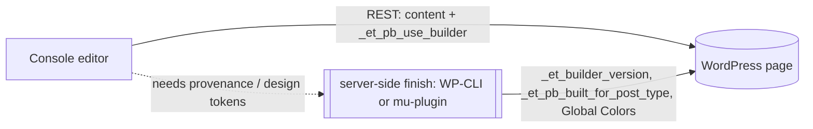

# REST vs WP-CLI — write-path responsibilities (Divi)

Verified empirically by [`scripts/local/rest_wpcli_roundtrip.py`](../../scripts/local/rest_wpcli_roundtrip.py)
(issue #9). Run it with `python3 scripts/local/rest_wpcli_roundtrip.py`; it asserts the
boundary below and logs the run to `job_log` (`job='rest_wpcli_roundtrip'`).

## TL;DR

**The console can edit Divi page content and enable the builder over plain REST**
(Application Passwords). A thin server-side "finish/publish" step (WP-CLI, or a custom
mu-plugin endpoint) is needed only to stamp builder-provenance meta and to manage
site-level design tokens.

> This **corrects an earlier assumption** that `_et_pb_use_builder` was unreachable via
> naked REST and required WP-CLI/SSH. It is reachable — see the mechanism note below.

## What REST (Application Passwords) can do

Authenticated as a user with edit capability (editor/admin), core `/wp/v2/pages` (and
`/posts`) can create/read/update:

- `title`, `slug`, `status`, `excerpt`, `content` (raw Divi shortcodes survive round-trip),
  `featured_media`, taxonomy terms.
- **Divi builder meta that Divi exposes to REST:** `_et_pb_use_builder`, `_et_pb_old_content`
  — settable via the `meta` field. Setting `_et_pb_use_builder=on` + posting Divi shortcode
  content is enough to make a page render as a Divi page and open in the Visual Builder.

Read raw shortcodes back with `GET /wp/v2/pages/{id}?context=edit` (returns `content.raw`);
without `context=edit` the response is rendered HTML, not shortcodes.

## What REST cannot do (WP-CLI / server-side only)

- **Builder-provenance meta** `_et_pb_built_for_post_type`, `_et_builder_version` — Divi does
  **not** register these for REST, so the `meta` field silently ignores them. Stamp them with
  WP-CLI (`wp post meta update ...`) as a finishing step for full fidelity.
- **Site-level Divi options** — Global Colors (`et_divi` option), module presets
  (`et_divi_builder_global_presets_ng`), Theme Options. Core REST `/wp/v2/settings` does **not**
  expose these. Manage them with WP-CLI (`wp option ...`) — this is the pipeline's design-token
  path (see [asset-pipeline](../../asset-pipeline/)).
- **Large payloads** over the server's REST/upload limit (Divi Library exports, media). WP-CLI
  bypasses it.

## Mechanism note (why the CLI check "disagrees")

Divi registers `_et_pb_use_builder` / `_et_pb_old_content` for REST on the `rest_api_init` hook,
which **only fires during a REST request**. So `wp eval 'get_registered_meta_keys("post","page")'`
(run under WP-CLI, outside a request) reports them as *not registered* — even though a live REST
request exposes them under the post's `meta` object and accepts writes. Trust the request-time
behavior, which the round-trip test exercises directly.

## Implication for the console write path (#18)

- **Per-page content editing = pure REST** from the BFF (Application Passwords). This is the
  common path and covers the authoring buffer publishing `content_fields` → WordPress.
- **A small server-side finish step** (WP-CLI invoked by the BFF, or a signed mu-plugin REST
  endpoint) stamps provenance meta on first publish and owns site-level Global Colors/presets.
- Capability matters: the console identity must have edit capability for the target post type;
  don't grant it option-level or site-admin powers just to publish content.
