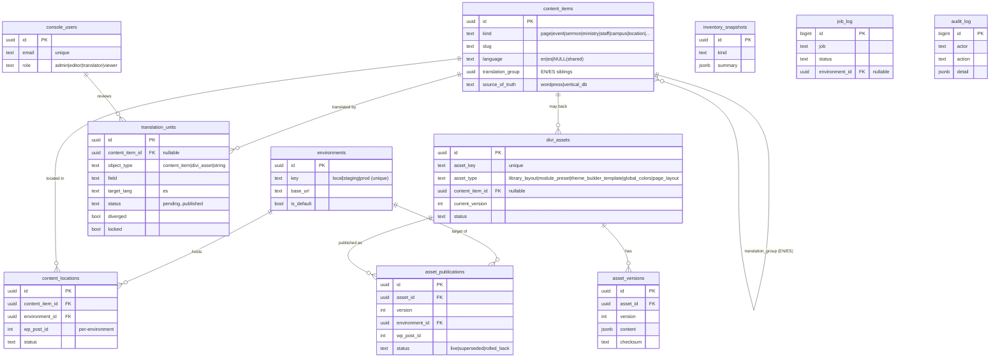

# Tooling DB — data model (schema v1)

The tooling DB is the project's **registry + review-state + audit** store (Postgres).
Migrations: [`tooling-db/migrations/`](../../tooling-db/migrations/). This document is the
reviewed design behind them.

## Principles (the boundaries that keep this correct)

1. **Content lives in WordPress (MySQL), not here.** This DB *points at* WordPress content;
   it must never become a second copy of pages/CPT entries. `title`/`slug` here are convenience
   labels — WordPress is the source of truth.
2. **Same content, many environments.** An asset or content item exists once but lives at
   *different* WordPress post IDs in `local` / `staging` / `prod`, so all WP-post mappings are
   **per-environment** (`content_locations`, `asset_publications`).
3. **Translation is field-level, human-decided.** AI proposes drafts into a queue; a bilingual
   reviewer approves. The `diverged` / `locked` flags protect intentional EN/ES divergence so AI
   never overwrites human-edited content.
4. **Three data stores, clear lanes.** WordPress MySQL = content · this tooling DB = registry/
   orchestration · **Vertical DB** (external Postgres, Planning Center) = operational data, read
   only, integrated via a contract — never written from here.

## ERD

## Entities

| Table | Purpose |
|---|---|
| `environments` | Deploy targets (`local`/`staging`/`prod`) with base URLs. Seeded. |
| `content_items` | Registry of WordPress content (identity/metadata only); `translation_group` links EN/ES siblings. |
| `content_locations` | Per-environment WordPress post mapping for a content item (the "different post id per env" fix). |
| `divi_assets` | Pipeline-managed Divi asset registry (Library layouts, presets, Global Colors, page layouts); optional link to a `content_item`. |
| `asset_versions` | Immutable version payloads (Divi JSON / shortcode / preset / global-colors) with checksums. |
| `asset_publications` | Record of publishing an asset **version** to an **environment** (one `live` per asset/env). |
| `translation_units` | Field-level translation with review state + `diverged`/`locked` guards. Replaces the v0 `translation_drafts` starter. |
| `console_users` | Console identities + roles (`admin`/`editor`/`translator`/`viewer`). |
| `inventory_snapshots` | Point-in-time inventory captures (e.g. `divi_recon`). |
| `job_log` | Pipeline job/audit log (now optionally scoped to an environment). |
| `audit_log` | Human/console actions (complements `job_log`). |

## Vertical DB boundary (out of scope to build)

The external **Vertical DB** (Planning Center operational data) is **read-only** to this system.
Integration is a contract — a read-only connection or a thin API in front of it — surfaced to
WordPress via a Divi shortcode/module. We do **not** replicate its tables here; at most we cache
rendered results in WordPress transients / Redis. See [docs/plan/04-vertical-db-integration.md](../plan/04-vertical-db-integration.md).

## Migrations

- `0001_init.sql` — v0 starter (assets, versions, inventory, job_log, + the retired `translation_drafts`).
- `0002_registry_v1.sql` — this model: environments, content_items/locations, asset_publications,
  translation_units, console_users, audit_log; links divi_assets→content_items and job_log→environments.

Apply/refresh with `scripts/local/tooling_db.sh migrate` (idempotent).
