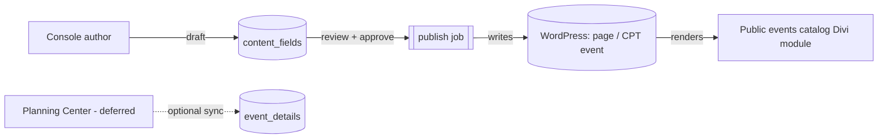

# Tooling DB — data model (schema v1)

The tooling DB is the project's **registry + review-state + audit** store (Postgres).
Migrations: [`tooling-db/migrations/`](../../tooling-db/migrations/). This document is the
reviewed design behind them.

## Principles (the boundaries that keep this correct)

1. **Content lives in WordPress (MySQL), not here.** This DB *points at* WordPress content;
   it must never become a second copy of pages/CPT entries. `title`/`slug` here are convenience
   labels — WordPress is the source of truth.
2. **Same content, many environments.** An asset or content item exists once but lives at
   *different* WordPress post IDs in `local` / `staging` / `prod`, so all WP-post mappings are
   **per-environment** (`content_locations`, `asset_publications`).
3. **Translation is field-level, human-decided.** AI proposes drafts into a queue; a bilingual
   reviewer approves. The `diverged` / `locked` flags protect intentional EN/ES divergence so AI
   never overwrites human-edited content.
4. **Authoring is a draft buffer, not a second home.** Non-devs author *source-language* text in
   the console; it lands in `content_fields` (versioned, reviewable), then a publish job pushes it
   into WordPress. WordPress stays the *published* source of truth. Console-authored fields flow
   **one-way** console→WP (single writer per field); layout stays in the Divi Visual Builder, so the
   draft and the published page never drift.
5. **Three data stores, clear lanes.** WordPress MySQL = content · this tooling DB = registry/
   orchestration · **Vertical DB** (external Postgres, Planning Center) = operational data, read
   only, integrated via a contract — never written from here.

## ERD

```mermaid
erDiagram
  environments      ||--o{ content_locations  : "hosts"
  environments      ||--o{ asset_publications : "target of"
  content_items     ||--o{ content_locations  : "located in"
  content_items     ||--o{ content_fields     : "authored as"
  content_items     ||--o{ translation_units  : "translated by"
  content_items     ||--o{ divi_assets        : "may back"
  content_items     ||--o| event_details      : "kind=event"
  content_items     ||--o{ event_campus_map   : "held at"
  content_items     ||--o{ event_category_map : "tagged"
  campuses          ||--o{ event_campus_map   : "filters"
  event_categories  ||--o{ event_category_map : "filters"
  content_fields    ||--o{ content_field_revisions : "history"
  divi_assets       ||--o{ asset_versions     : "has"
  divi_assets       ||--o{ asset_publications : "published as"
  console_users     ||--o{ translation_units  : "reviews"
  content_items     ||--o{ content_items      : "translation_group (EN/ES)"

  environments {
    uuid id PK
    text key "local|staging|prod (unique)"
    text base_url
    bool is_default
  }
  content_items {
    uuid id PK
    text kind "page|event|sermon|ministry|staff|campus|location|..."
    text slug
    text language "en|es|NULL(shared)"
    uuid translation_group "EN/ES siblings"
    text source_of_truth "wordpress|vertical_db"
  }
  content_locations {
    uuid id PK
    uuid content_item_id FK
    uuid environment_id FK
    int  wp_post_id "per-environment"
    text status
  }
  divi_assets {
    uuid id PK
    text asset_key "unique"
    text asset_type "library_layout|module_preset|theme_builder_template|global_colors|page_layout"
    uuid content_item_id FK "nullable"
    int  current_version
    text status
  }
  asset_versions {
    uuid id PK
    uuid asset_id FK
    int  version
    jsonb content
    text checksum
  }
  asset_publications {
    uuid id PK
    uuid asset_id FK
    int  version
    uuid environment_id FK
    int  wp_post_id
    text status "live|superseded|rolled_back"
  }
  translation_units {
    uuid id PK
    uuid content_item_id FK "nullable"
    text object_type "content_item|divi_asset|string"
    text field
    text target_lang "es"
    text status "pending..published"
    bool diverged
    bool locked
  }
  content_fields {
    uuid id PK
    uuid content_item_id FK
    text field_key "title|summary|body|when_text|cta_url|..."
    text language "en"
    text value
    text status "draft|in_review|approved|published"
    int  version
  }
  content_field_revisions {
    bigint id PK
    uuid content_field_id FK
    int  version
    text value
  }
  event_details {
    uuid content_item_id PK "1:1 kind=event"
    timestamptz starts_at "nullable"
    text when_text "fuzzy display override"
    text registration_url
    bool featured
    text external_source "planning_center|NULL"
  }
  campuses {
    uuid id PK
    text key "unique"
    text name
    bool active
  }
  event_categories {
    uuid id PK
    text key "unique"
    text name
  }
  event_campus_map {
    uuid event_item_id FK
    uuid campus_id FK
  }
  event_category_map {
    uuid event_item_id FK
    uuid category_id FK
  }
  console_users {
    uuid id PK
    text email "unique"
    text role "admin|editor|translator|viewer"
  }
  inventory_snapshots {
    uuid id PK
    text kind
    jsonb summary
  }
  job_log {
    bigint id PK
    text job
    text status
    uuid environment_id FK "nullable"
  }
  audit_log {
    bigint id PK
    text actor
    text action
    jsonb detail
  }
```

## Entities

| Table | Purpose |
|---|---|
| `environments` | Deploy targets (`local`/`staging`/`prod`) with base URLs. Seeded. |
| `content_items` | Registry of WordPress content (identity/metadata only); `translation_group` links EN/ES siblings. |
| `content_locations` | Per-environment WordPress post mapping for a content item (the "different post id per env" fix). |
| `content_fields` | Field-level **source** text authored in the console (draft→review→published), unique per `(item, field, language)`. The console's write target; published into WordPress. |
| `content_field_revisions` | Append-only edit history for `content_fields` (rollback + audit). |
| `event_details` | Structured catalog attributes for a `content_items` row of `kind='event'` (1:1): dates (nullable), `when_text` for fuzzy cases, registration, `featured`, + nullable Planning Center sync columns. |
| `campuses` | Controlled vocab for the campus filter; optional link to a campus landing `content_item`. |
| `event_categories` | Controlled vocab for audience/category tabs (Kids, Men, Next Steps, …). |
| `event_campus_map` / `event_category_map` | Many-to-many event↔campus / event↔category (an event can be "Multiple Locations" and multi-tagged). |
| `divi_assets` | Pipeline-managed Divi asset registry (Library layouts, presets, Global Colors, page layouts); optional link to a `content_item`. |
| `asset_versions` | Immutable version payloads (Divi JSON / shortcode / preset / global-colors) with checksums. |
| `asset_publications` | Record of publishing an asset **version** to an **environment** (one `live` per asset/env). |
| `translation_units` | Field-level translation with review state + `diverged`/`locked` guards. Replaces the v0 `translation_drafts` starter. |
| `console_users` | Console identities + roles (`admin`/`editor`/`translator`/`viewer`). |
| `inventory_snapshots` | Point-in-time inventory captures (e.g. `divi_recon`). |
| `job_log` | Pipeline job/audit log (now optionally scoped to an environment). |
| `audit_log` | Human/console actions (complements `job_log`). |

## Events catalog + console authoring (v1.1)

Modeled after a filterable church events catalog (campus filter, category tabs, a "featured" rail,
and fuzzy "when" text). Two flows:

**Authoring (source text).** The console writes to `content_fields` (one row per
`item × field × language`); edits append to `content_field_revisions`. On approval a publish job
copies the value into WordPress (page content / CPT meta). WordPress renders; the tooling DB keeps
the editable draft, version history, and review state. This is the source-language mirror of
`translation_units`.

**Events.** An event is a `content_items` row (`kind='event'`) + a 1:1 `event_details` row +
many-to-many `campuses` / `event_categories`. Its display text (title, blurb, `when_text`) lives in
`content_fields`. At runtime the public catalog is a WordPress CPT `event` + taxonomies queried by a
Divi module — the tooling DB is **not** in the serving path; it is the authoring/registry side.

**Planning Center (deferred).** `event_details` / `campuses` carry nullable
`external_source` / `external_id` / `last_synced_at` so a Planning Center feed can populate or
refresh events later with **no migration**. Console-authored is the flow we build now.

## Vertical DB boundary (out of scope to build)

The external **Vertical DB** (Planning Center operational data) is **read-only** to this system.
Integration is a contract — a read-only connection or a thin API in front of it — surfaced to
WordPress via a Divi shortcode/module. We do **not** replicate its tables here; at most we cache
rendered results in WordPress transients / Redis. See [docs/plan/04-vertical-db-integration.md](../plan/04-vertical-db-integration.md).

## Migrations

- `0001_init.sql` — v0 starter (assets, versions, inventory, job_log, + the retired `translation_drafts`).
- `0002_registry_v1.sql` — registry model: environments, content_items/locations, asset_publications,
  translation_units, console_users, audit_log; links divi_assets→content_items and job_log→environments.
- `0003_events_and_authoring.sql` — authoring buffer (content_fields, content_field_revisions) and
  events catalog (event_details, campuses, event_categories, event_campus_map, event_category_map).

Apply/refresh with `scripts/local/tooling_db.sh migrate` (idempotent).
